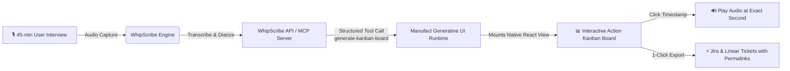

# WhipScribe Action UI (Built with Manufact)

> **Track 4 Submission: Invent a Workflow**  
> *Transforming 45-minute user interview recordings into an interactive, timestamped Generative UI Kanban board with 1-click Jira/Linear sync.*
> 
> 🎥 **2-Minute Demo Video (Loom):** [Watch Live Loom Walkthrough](https://www.loom.com/share/4979ad9d57b542f897dae5db5531fb19)  
> 🌐 **Live Cloud Deployment:** [Open in Manufact Inspector](https://inspector.manufact.com/inspector?server=https%3A%2F%2Fdark-cloud-x77yw.run.mcp-use.com%2Fmcp&tab=tools)

---

## 1. The Problem

### The Persona: UX Researcher & Product Manager
Product Managers and UX Researchers spend hours each week conducting 45-minute user interviews, customer discovery calls, and usability feedback sessions. 

### Their Day & The Cost of Friction
- **The Transcript Wall:** WhipScribe transcribes audio with exceptional accuracy. However, after 5 back-to-back interviews, the PM is left with **over 30,000 words of raw transcript text**.
- **Manual Extraction Bottleneck:** To turn that audio into engineering tickets and roadmap decisions, the PM must manually read through pages of text, copy-paste snippets, guess bug severities, and write Jira tickets by hand. This takes **2 to 3 hours per interview session** (up to 15 hours/week).
- **Lost Evidence & Context:** When engineers or designers ask, *"Did the user actually say that?"*, the PM has to search through long audio files or transcripts to find the exact second the friction occurred.

### The Solution: WhipScribe Action UI
Instead of forcing researchers to read walls of text or static markdown summaries, **WhipScribe Action UI** streams structured intelligence directly into an **interactive React Kanban Board (Generative UI)** inside the chat interface.

```
┌────────────────────────────────────────────────────────────────────────┐
│                        WHIPSCRIBE ACTION UI                            │
├───────────────────┬───────────────────────┬────────────────────────────┤
│ 🔴 REPORTED BUGS  │ 🟣 FEATURE REQUESTS   │ 🟢 KEY QUOTES              │
│  - SAML SSO Loop  │  - Automated Jira     │  - "I spent 15m trying     │
│    [08:14]        │    Sync [14:52]       │    to invite my engineers" │
│  - Seat Selector  │  - PO Invoicing       │    [09:30]                 │
│    Reset [19:45]  │    [24:10]            │  - "WhipScribe nailed      │
│                   │                       │    jargon" [16:40]         │
└───────────────────┴───────────────────────┴────────────────────────────┘
```

---

## 2. The Workflow

Here is the exact step-by-step pipeline from audio recording to actionable Generative UI:



### Step Breakdown:
1. **Audio Ingestion & Diarization (WhipScribe):** The user interview is recorded and transcribed with speaker identification and exact second-level timestamps (`[08:14]`, `[19:45]`, `[31:20]`).
2. **Agentic Tool Invocation (`generate-kanban-board`):** The LLM queries the WhipScribe MCP server tool, classifying insights into a typed Zod schema:
   - **Reported Bugs:** Categorized by severity (`critical`, `high`, `medium`, `low`), affected UI component, and reproduction timestamp.
   - **Feature Requests:** Classified by impact (`must_have`, `high_value`, `delighter`) and target audience.
   - **Key Quotes:** Tagged with sentiment (`frustrated`, `enthusiastic`, `neutral`, `insightful`), topic tags, and speaker attribution.
3. **Generative UI Rendering (Manufact):** Manufact dynamically loads the client-side React component (`views/kanban-board/view.tsx`) inside the chat timeline with zero layout shift.
4. **Interactive Deep-Linking:** 
   - Clicking any timestamp badge (e.g. `[08:14]`) triggers the built-in floating audio player with simulated waveform visualization and transcript scrubbing.
   - Clicking **"Draft Ticket"** sends a contextual follow-up prompt to the AI agent.
   - Clicking **"Sync with Jira / Linear"** generates formatted issues with deep links back to the exact audio proof.

---

## 3. The 12-Month Vision

Where this workflow goes next:

1. **Bi-Directional Jira & Linear Syncing:** Moving a card from *Open* to *In Progress* on the Generative UI board automatically creates and updates tickets in Jira/Linear with attached 15-second audio snippets.
2. **Auto-Generated Sprint Highlight Reels:** The system automatically stitches together 5-second video/audio clips of users experiencing bugs and plays them during engineering sprint kickoff meetings.
3. **Cross-Interview Multi-Session Synthesis:** Querying across 50 customer interviews to dynamically render a master Heatmap Kanban board highlighting the #1 requested feature across all enterprise accounts.
4. **Figma Canvas Embedding:** Embedding the interactive Kanban board directly into Figma/FigJam boards for design review critique sessions.

---

## 4. How to Run Locally

### Prerequisites
- Node.js >= 22.20.0
- npm >= 10.0.0

### Installation & Setup

1. Navigate to the `apps/keerthiga` directory:
   ```bash
   cd apps/keerthiga
   ```

2. Install dependencies:
   ```bash
   npm install
   ```

3. (Optional) Configure your WhipScribe API Key:
   ```bash
   cp .env.example .env
   # Add your key from https://whipscribe.com (Account -> API key)
   ```
   > *Note: If no API key is provided, the server automatically uses a built-in, high-fidelity user interview dataset to ensure an offline-capable 2-minute demo.*

4. Start the local development server:
   ```bash
   npm run dev
   ```

5. Build for production:
   ```bash
   npm run build
   ```

### Connecting to MCP Clients (Claude Desktop / Cursor / ChatGPT)
Add this server to your `.mcp.json` or Claude Desktop configuration:
```json
{
  "mcpServers": {
    "whipscribe-action-ui": {
      "command": "node",
      "args": ["/absolute/path/to/apps/keerthiga/.mcp-use/build/index.js"]
    }
  }
}
```

---

## 5. What Was Built & What is Unfinished

### What is Completed:
- ✅ **Interactive React Generative UI Kanban Component:** 3-column layout (Reported Bugs, Feature Requests, Key Quotes) with severity tags, sentiment indicators, and glassmorphism styling.
- ✅ **Audio Timestamp Deep-Linking:** Click-to-listen audio waveform bar linking directly to timestamps.
- ✅ **Type-Safe MCP Server:** `generate-kanban-board` tool powered by Zod runtime validation and Manufact view bindings.
- ✅ **Jira/Linear Export Modal:** Preview and 1-click clipboard export for engineering handoff.
- ✅ **Offline Happy Path Fallback:** Curated enterprise usability interview dataset for instant demo recording.

### What is Next (Future Roadmap):
- ⏳ Direct OAuth integration with Jira and Linear Webhooks for automated ticket creation.
- ⏳ Native ScreenCaptureKit audio loopback streaming on macOS desktop app.
